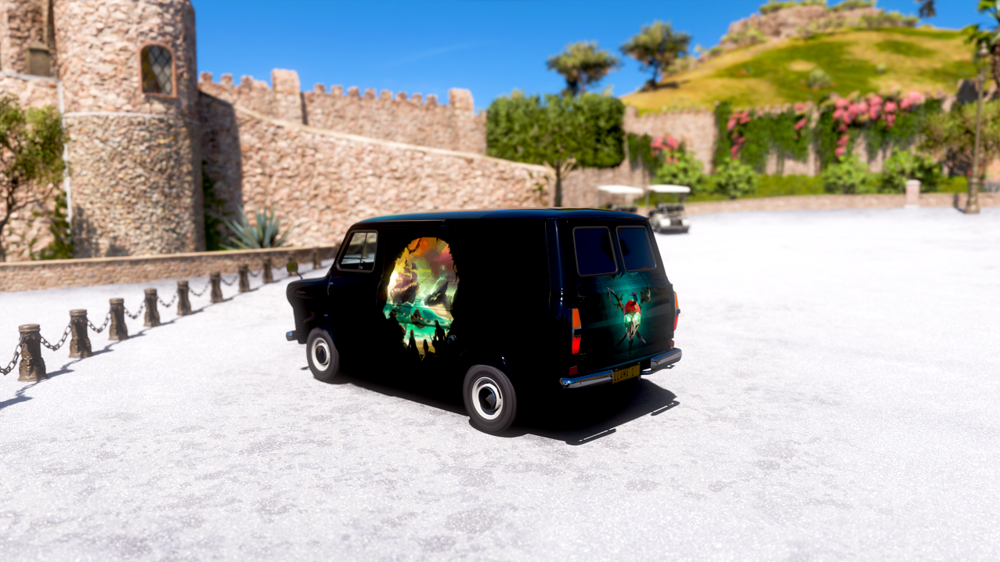
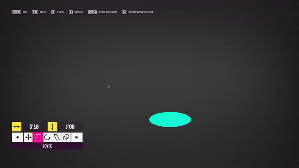
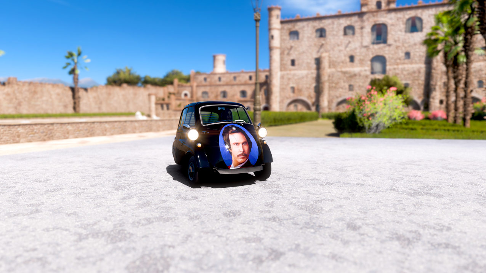
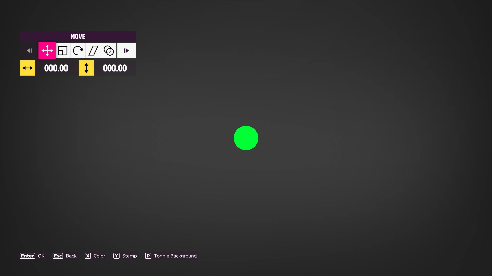

# AutoForzaLiveryEditor
This is ONLY for your own cars for offline personal use, do not share to Forza Online, play online with the vehicles, or do anything like sell a vehicle with the livery attached.
It is a Windows program to import images as shapes into the Forza Horizon 5 Livery Editor to test out ideas by simulating moving the mouse and pressing keyboard buttons to create hundreds/thousands of basic shapes that look like an image. It uses JSON exports from the [Geometrize app](https://www.geometrize.co.uk/) and draws out the shapes for you in the Forza Livery Editor.

(video vertically flipped because of the known issue mentioned below)

# Responsibility disclaimer:
This program should only be used to test out design ideas, I am not responsible for anything that could happen as a result of using it. Always abide by Forza rules.
This program is provided as-is without any warranties of any kind. You are solely responsible for determining the appropriateness of using the program and assume any risks associated with it. Do not break the Forza rules, and USE IT AT YOUR OWN RISK.
There is another project that does a similar thing to this [here](https://github.com/forza-painter/forza-painter) but it modifies the memory of the game, which I am uncomfortable with as I would guess it breaches the Forza terms of "modding" the game. Simulating mouse and keyboard input all happens outside of the game, and the game process is never touched, so should not (don't trust my guess on this) fall until any modding rules. Remember that you can be banned at the discretion of the developers.

# Bad coding disclaimer
I made this as a quick little prototype for myself, this is not good or production-ready code

# Known issues
- It doesn't properly handle resolutions that aren't 2560x1440 yet, simply because of a hardcoded pixel position for the OCR.
- It is very timing dependant, and your results may vary. Alongside the exe you will find appsettings.json. If you have issues then you can trying slowing everything down by opening that file and changing the DelayMultiplier value of 1 to something like 1.5. That means that every "wait" action in the program will be * 1.5, making it wait more before doing the next action.
- Currently the image is vertically flipped, when you apply it to a car you'll need to flip it the right way up.

# Getting Forza Ready
1) Open Forza Horizon 5, click Create Vinyl Groups
2) Press OK to create a new layer
3) Select 'Apply a vinyl shape'
4) Select the circle (one down from the top left)
5) Choose any color
6) It should look like this, and you're now ready.

# Running the app
1) Run ForzaVinylPainting.exe as admin
2) If you have multiple monitors then put it on the second one so you can see progress logs.
3) Follow the instructions in the app to accept the disclaimer then it should list all the JSON files in the Images folder. By default there is one called SimpleTest.json which you should try using first.
4) Once you've selected the file you want it will tell you to setup Forza as explained above.
5) Open Forza again then press F6 to start the process. The app will run in the background. 
6) If you want to pause the process then Press F7. To resume again press F6 but make sure you've opened Forza again before doing that. To immediately stop the app press F8.
7) It will draw all the shapes. This takes a long time.
8) If you've run the SimpleTest.json then your final image should look like this, if it doesn't then raise an issue.

9) Optionally create a mask around it to get rid of the surrounding blobs

# Generating the JSON files for your image
1) Download the [Geometrize app](https://www.geometrize.co.uk/) 
2) [Optional for the highest quality] Click File -> Global Preferences -> Performance, and set the max width and height to a little bit less than half your screen resolution. So for a 2560x1440 screen it would be 1270 width, and 710 height. For a 1920x1080 screen it would be 950 width, and 530 height. Alternatively just leave it low at 256 for both, but that will limit how detailed things can look
3) Open an image and in the task settings on the right change opacity to 255, check the Rotated Ellipses box, and uncheck the other shapes.
4) Click Start near the bottom and let it run for however many shapes you want. The more shapes the more detailed, but also the longer it will take to create in Forza. The Vinyl shape limit is 3000 in Forza, but some sides of the car like the front have lower limits like 1000. Press Stop once you've reached the number of shapes you want.
5) Click Exporters at the bottom right, and then Save Geometry Data. Save the JSON file to the Images folder in the downloaded or built release (it is next to the exe).

# Some other examples

